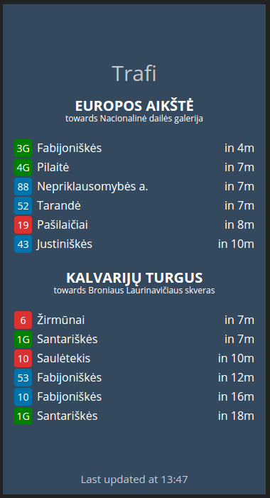

 Trafi.com widget for Dashing.io
========================================================



Usage
-----

* Copy contents of `jobs/` and `widgets/` to your dashing project
* Configure your `config.ru` in `configure` block, possibly after `set :auth_token, 'yourtoken'` (see *Configuration* section on what each option does)

```ruby
  set :trafi_api_key, ENV['TRAFI_API_KEY']
  set :trafi_region, 'vilnius'

  # Use https://developer.trafi.com/docs to find out stop ids
  set :trafi_stops, [
    { id: 'vln_0104', span: 180 }, # Europa towards dailes galerija
    { id: 'vln_0704', span: 420 }, # Kalvariju turgus towards Laurinaviciaus skveras
  ]
```

* Place a widget on your dashboard

```html
    <li data-row="2" data-col="5" data-sizex="1" data-sizey="2">
      <div data-id="trafi" data-view="Trafi"></div>
    </div>
```

Configuration
-------------

| Option | Explanation |
| ------ | ----------- |
| `trafi_api_key` | A string which contains API Key which is being sent to trafi.com API. Set up one at https://developer.trafi.com/ |
| `trafi_region`  | A string which contains region name which is sent to `/departures` endpoint |
| `trafi_stops`   | An array of value objects containing `id` and `span` keys. `id` represents a stop id which can be fetched at https://developer.trafi.com/docs under `/stops/nearby` endpoint and `span` represents time in seconds which will not show entries for configured time if current time + span time > departure time. As usually you do now want to show bus stop entries saying bus will arrive in 1 minute but it takes 10 minutes to walk to. |

License
-------

This widget is released under the [MIT License](LICENSE).
